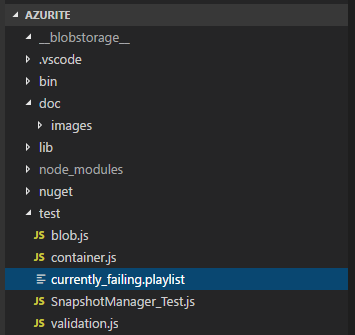
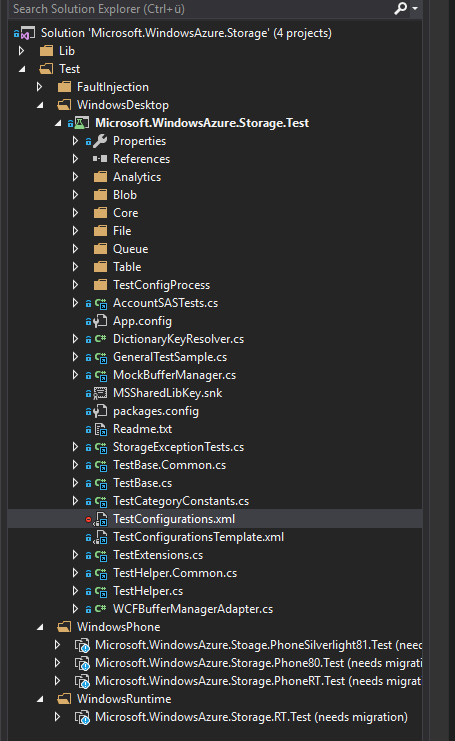
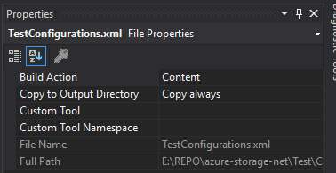
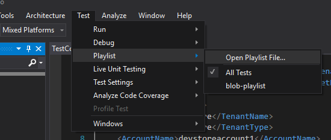
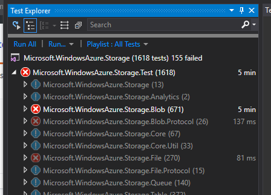

# Azurite's TDD with Visual Studio

As we are emulating the Azure Storage API, we are using the Azure Storage SDK tests as a means to drive TDD for Azurite.

You will need to clone the Azure Storage SDK found [here](https://github.com/Azure/azure-storage-net), and the associated test dependenices.
Details can be found here: [https://github.com/Azure/azure-storage-net#test-dependencies](https://github.com/Azure/azure-storage-net#test-dependencies)  

We shall maintain test playlists of relevant and currently failing tests in the test folder here:

```shell
./test/currently_failing.playlist
```



In order to use this playlist, you need to clone the Azure Storage SDK found [here](https://github.com/Azure/azure-storage-net).  

You can then run the Test Playlists within Visual Studio against a running instance of Azurite.

Visual Studio is currently available for [Windows and macOS](https://www.visualstudio.com/vs).

## Configuring Visual Studio and Azurite to run tests with the SDK solution

You can run multiple instances of Azurite to simulate multiple endpoints used by the test playlist. 

We shall maintain a relevant  list of failing tests from the SDK as a playlist file, as well as the required TestConfigurations.XML required to run the tests.

You will need to create the TestConfiguration.xml (see ./test/TestConfigurations.xml), and ensure that the build action is set to copy to the output folder:






## Addressing an issue based on a failing test:

If you want to address an issue in the list of the SDKs Failing Test Playlist, please open an [issue here](https://github.com/Azure/Azurite/issues), to let others know that you are already working on it.

Once you have opened the SDk's solution, use the test menu to open the Playlist File for Azurite.



You can then use the "Run" command in the "test explorer" to run all tests, the playlist file, or a single test.




