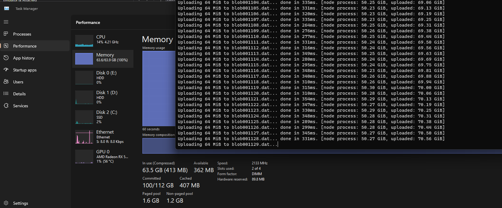

# Add an option to use only in-memory persistence

- Author Name: Joel Verhagen ([@joelverhagen](https://github.com/joelverhagen))
- GitHub Issue: [Azure/Azurite#2227](https://github.com/Azure/Azurite/issues/2227)

## Summary

Currently, Azurite uses disk-based persistence for all three storage endpoints (blobs, queues, tables). It is not
possible to change this default behavior to store information only in-memory. This proposal suggests the addition of an
`--inMemoryPersistence` option for Azurite which will disable all disk-based persistence and instead store the data only
in-memory of the Azurite process (node).

## Motivation 

The current usage pattern of Azurite assumes that the caller is interested in persisting stored data beyond the lifetime
of the node process. This certainly is useful for extended testing scenarios or where Azurite is actually used for
production-like scenarios (perhaps a best-effort approach of free, on-prem Azure Storage). However, some Azurite use
cases are more ephemeral in nature. For example, if you simply want to use Azurite for a single test run in a CI
pipeline, you don't need the storage to persist beyond the lifetime of the node process.

This sample owned by the Azure-Samples GitHub organization illustrates such a case:

[`automated-testing-with-azurite/build/azure-pipelines.yml`](https://github.com/Azure-Samples/automated-testing-with-azurite/blob/fb5323344056cfb2e43cbff91ed53858a71b2d8c/build/azure-pipelines.yml#L14-L22)

For the NuGet team's [NuGet/Insights](https://github.com/NuGet/Insights) project, a similar approach is used in an Azure
DevOps release pipeline, allowing a simple, no-frills Azure Storage instance available with a simple `npx azurite`.

[`Insights/.pipelines/Retail.PullRequest.yml`](https://github.com/NuGet/Insights/blob/5d0b5ed62a71b10d93d77f5135b4876a1b1bf4dc/.pipelines/Retail.PullRequest.yml#L164-L189)

Without the option to disable disk-based persistence, an ephemeral use of Azurite requires an explicit clean-up step by
some actor to ensure disk space is not filled up over time. In the case of cloud-hosted Azure DevOps agents, this is
sometimes handled by the build agent software (cleaning up the working directory automatically, for example) but I think
it's best not to assume this, especially since it is possible that the write location of the Azurite data is
inadvertently outside of the scope of any auto-cleanup process.

The disk-based persistence also incurs an additional performance penalty, especially when writing extents. This is
particularly egregious for queue messages that have a blocking disk operation per queue message enqueue and dequeue. In
some situations this performance is tolerable but for extended integration tests with dozens or even hundreds of queue
messages processed, the performance delta is noticeable. In a prototype implementation of this design, the following
performance improvement for blob and queue was seen for a simple write-then-read pattern for each storage service.

| Method         |       Mean |     Error |    StdDev |
| -------------- | ---------: | --------: | --------: |
| InMemory_Blob  | 1,860.0 us |  25.45 us |  21.25 us |
| InMemory_Queue | 1,562.3 us |  26.89 us |  25.15 us |
| InMemory_Table |   975.7 us |   8.65 us |   7.23 us |
| Disk_Blob      | 5,505.8 us |  91.37 us |  89.74 us |
| Disk_Queue     | 5,327.1 us | 104.47 us | 111.78 us |
| Disk_Table     |   963.6 us |  11.34 us |   9.47 us |

As you can see, the sample blob and queue workflow (write then read) is nearly 3 times faster without the disk
operation. Table storage operations have no significant change because the 5-second disk persistence step done by LokiJS
is not easily captured in a micro-benchmark. 

([benchmark implementation available on Gist](https://gist.github.com/joelverhagen/8394b3eaa276f4baa07806867b5caa37))

For the current disk-based implementation, there are no strong consistency or checkpoint guarantees. The LokiJS
persistence configuration has auto-saving set to true, but this is only done every 5 seconds meaning an abrupt
termination of the node process can still lead to data loss (much like an in-memory-only persistence model suggested by
this design).

Finally, additional failure modes are present when disk-based persistence is enabled. Several issues have been opened in
the past related to this. For users where long-lived storage is needed, this design will not solve their problems since
they need the disk storage. For other users where ephemeral storage is acceptable if not ideal, this design will resolve
those problems. Example issues:

- [Azure/Azurite#1687](https://github.com/Azure/Azurite/issues/1687), [Azure/Azurite#804
  (comment)](https://github.com/Azure/Azurite/issues/803#issuecomment-1244987098) - additional permissions may be needed
  for disk persistence, depending on the configured path
- [Azure/Azurite#1967](https://github.com/Azure/Azurite/issues/1967) - there are OS limits for file handles

## Explanation

### Functional explanation

A ``--inMemoryPersistence`` command line option will be introduced which will do two things:

1. Switch all LokiJS instances from the default `fs` (file system) persistence model to `memory`.
1. Use a `MemoryExtentStore` for blob and queue extent storage instead of `FSExtentStore`.

By default, the `MemoryExtentStore` will limit itself to 50% of the total physical memory on the machine as returned by
[`os.totalmem()`](https://nodejs.org/api/os.html#ostotalmem). This can be overridden using a new `--extentMemoryLimit
<megabytes>` option. If this option is specified without `--inMemoryPersistence`, the CLI will error out. The `os.freemem()`
will not be queried because this will lead to unpredictable behavior for the user where an extent write operation (blob
content write or enqueue message) will fail intermittently based on the free memory. It is better to simple us a defined
amount of memory per physical machine and potential exceed the free memory available, thus leveraging virtual memory
available to the node process.

The SQL-based persistence model will not support the in-memory persistence options and will error out if both the
`AZURITE_DB` environment variable is set and the either of the in-memory persistence options are specified.

Similar options will be added to the various related configuration types, configuration providers, and the VS Code
options.

In all cases, the ``--inMemoryPersistence`` option will default to "off" retaining existing behavior by default. This
ensures backward compatibility but will provide the ability for users to cautiously opt-in to this behavior.

### Technical explanation

The LokiJS module already supports in-memory persistence out of the box. This can be opted into by using the following
options parameter to the constructor:
```typescript
{
  persistenceMethod: "memory"
}
```

Note that LokiJS already is primarily an in-memory store, but Azurite's current usage of it periodically writes the data
to disk to best-effort persistence spanning multiple process lifetimes.

A new `MemoryExtentStore` implementation will be introduced to be used instead of `FSExtentStore`. This will store
extents in an instance-level map. The key of the map will be a UUID (GUID) and the value will be an extension of the
existing `IExtentChunk` interface. The extension will be `IMemoryExtentChunk` which has a single additional property:
```typescript
export interface IMemoryExtentChunk extends IExtentChunk {
  chunks: (Buffer | string)[]
}
```

This will allow extent write operations to be stored in-memory (a list of buffered chunks) and read operations to fetch
the list of chunks on demand. The implementation will be simpler than the `FSExtentStore` in that all extent chunks will
have their own extent ID instead of sometimes being appended to existing extent chunks.

To support the implementation of `MemoryExtentStore` and to allow a shared memory limit between blob and queue extents,
a `MemoryExtentChunkStore` will be added which is the actual store of the `IMemoryExtentChunk` map mentioned above. Both
the blob and queue instances of `MemoryExtentStore` will share an instance of `MemoryExtentChunkStore` which allows the
proper bookkeeping of total bytes used. The `MemoryExtentChunkStore` will operate on two keys, `category: string` and
`id: string`. The category will either be `"blob"` or `"queue"` (allowing clean operations to clean only blob extents or
only queue extents) and the ID being the extent GUID mentioned before.

All unit tests will be run on both the existing disk-based persistence model and the in-memory model. There is one
exception which is the `13. should find both old and new guids (backward compatible) when using guid type, @loki` test
case. This operates on a legacy LokiJS disk-based DB which is a scenario that is not applicable to an in-memory model
since old legacy DBs cannot be used.

The test cases will use the in-memory-based persistence when the `AZURITE_TEST_INMEMORYPERSISTENCE` environment variable
is set to a truthy value.

When a write operation will exceed the default 50% total memory limit or the limit specified by `--extentMemoryLimit`,
an HTTP 409 error will be returned to the called allowing tools and SDKs to avoid retries and notify the end user of the
problem. The error response message will look something like this:

```http
HTTP/1.1 409 Cannot add an extent chunk to the in-memory store. Size limit of 4096 bytes will be exceeded
Server: Azurite-Blob/3.27.0
x-ms-error-code: MemoryExtentStoreAtSizeLimit
x-ms-request-id: 9a7967f2-578f-47a4-8006-5ede890f89ff
Date: Wed, 25 Oct 2023 23:07:43 GMT
Connection: keep-alive
Keep-Alive: timeout=5
Transfer-Encoding: chunked
Content-Type: application/xml

<?xml version="1.0" encoding="UTF-8" standalone="yes"?>
<Error>
  <Code>MemoryExtentStoreAtSizeLimit</Code>
  <Message>Cannot add an extent chunk to the in-memory store. Size limit of 4096 bytes will be exceeded
RequestId:9a7967f2-578f-47a4-8006-5ede890f89ff
Time:2023-10-25T23:07:43.658Z</Message>
</Error>
```

## Drawbacks

Because extents are no longer stored on disk, the limit on the amount of data Azurite can store in this mode is no
longer bounded by the available disk space but is instead bounded by the amount of memory available to the node process.
To mitigate this risk, the `--extentMemoryLimit` is defaulted to 50% of total memory.

As a side note, the limit on the memory available to the node process is only loosely related to the physical memory of
the host machine. Windows, Linux, and macOS all support virtual memory which allows blocks of memory to be paged onto
disk.

As you can see below, a load test of the in-memory implementation allows uploads exceeding 64 GiB (which was the amount
of physical memory available on the test machine). There will be a noticeable performance drop when this happens but it
illustrates how the storage available to `--inMemoryPersistence` can be quite large. 



([load test implementation available on Gist](https://gist.github.com/joelverhagen/8394b3eaa276f4baa07806867b5caa37))

This can be a problem if Azurite is used for persisting very large files or many thousands of large queue messages.

If the user of Azurite needs to store large files, then they should avoid using this feature and instead rely on
disk-based persistence.

## Rationale and alternatives

The in-memory extent store will not compact, concatenate or otherwise manipulate the byte arrays (`Buffer` instances)
that are provided by write operations. For large blobs, this can lead to a large array of chunks (based on the buffering
behavior provided by the web application and transport layer). This decision was made to reduce the number of bytes
copied during and upload operation and to avoid the need for a huge amount of contiguous memory. If needed, we can
evaluate concatenating some or all of the buffered chunks for performance or memory reasons.


## Prior Art

N/A

## Unresolved Questions

N/A

## Future Possibilities

We could consider a more complex set of configuration values where the user can decide on in-memory persistence
individually in all of these places:

- Blob LokiJS
- Blob Extent store
- Queue LokiJS
- Queue Extent store
- Table LokiJS

The current proposal allows only two options: allow these places to use disk-persistence (when `--inMemoryPersistence`
is not specified) or none of these places to use disk-persistence (when ``--inMemoryPersistence`` is specified).

Another future possibility would be to limit the memory used by LokiJS, but this would require support from the LokiJS
library and would likely be much more complex in nature because measuring the memory consumption of a heterogenous
object structure that LokiJS allows is very different that simply measuring the total number of bytes used in extents as
currently designed with `--extentMemoryLimit`.