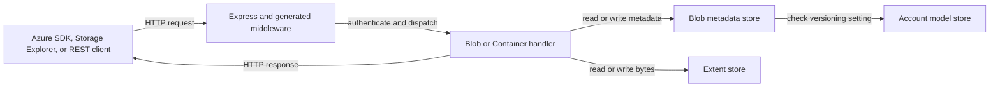
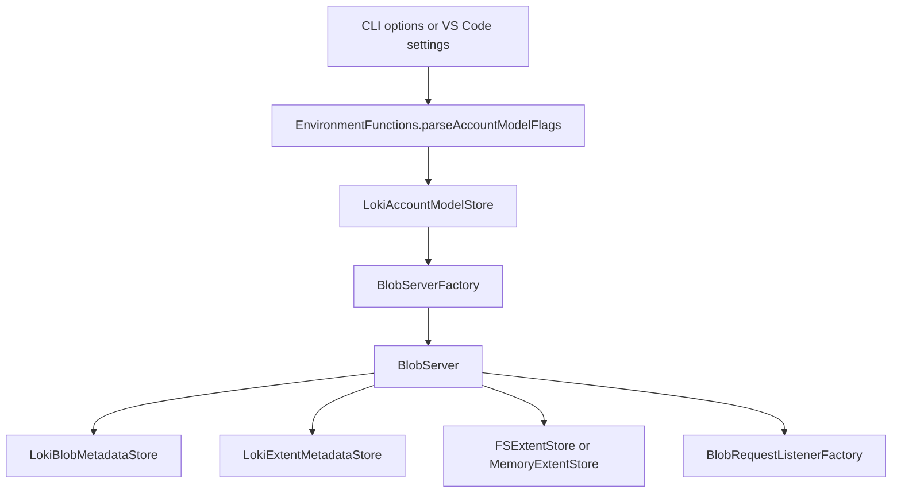
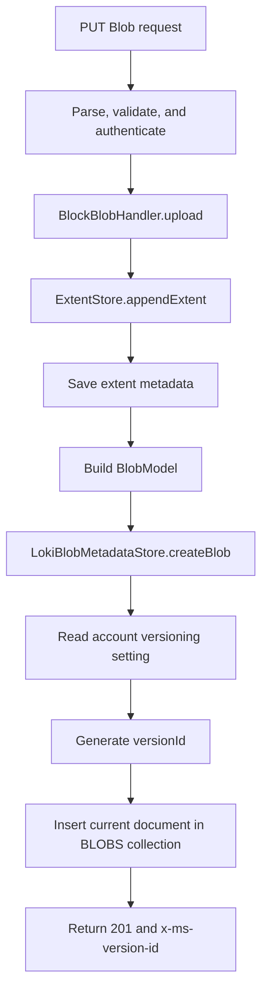
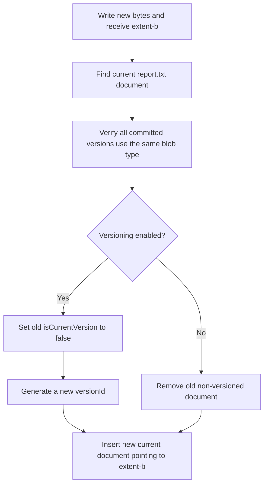
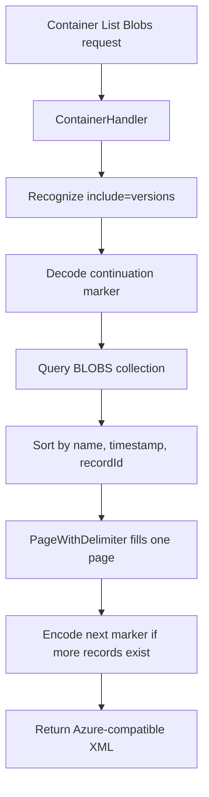
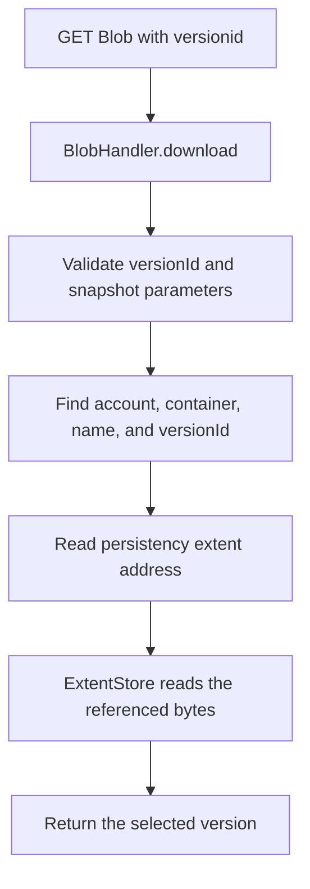
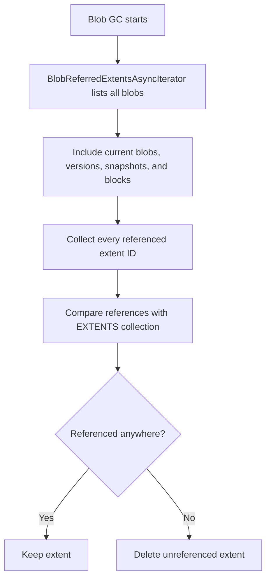

# Add Blob Versioning Support

- Author Name: Rodolfo Orozco Vasquez ([@rorozcov](https://github.com/rorozcov))
- GitHub Issue: [Azure/Azurite#665](https://github.com/Azure/Azurite/issues/665)

## Summary

This design adds Azure Blob Storage versioning support to Azurite. When versioning is enabled for an account, Azurite keeps previous values of a blob when supported operations modify or delete the current value. Applications can list, read, restore, and delete those previous versions during local development.

The implementation follows the [Azure Blob Storage versioning guidelines](https://learn.microsoft.com/en-us/azure/storage/blobs/versioning-overview) as closely as Azurite's supported feature set allows. Versioning is opt-in, disabled by default, and supported only by the default LokiJS metadata implementation. It is not supported by the SQL metadata implementation.

## Plain-language overview

Without versioning, uploading `report.txt` again replaces the old value:

```text
Upload 1: report.txt = "Draft"
Upload 2: report.txt = "Final"

Stored result: "Final"
```

With versioning enabled, the old value remains available:

```text
Version 1: report.txt = "Draft"  (previous)
Version 2: report.txt = "Final"  (current)
```

The blob name does not change. Azurite distinguishes the records with a generated `versionId` and marks one record as the current version.

The simplest mental model is:

- The account model database answers: **Is versioning enabled for this account?**
- The blob metadata database answers: **Which versions exist, and which one is current?**
- The extent database answers: **Which physical data files exist?**
- The `__blobstorage__` directory contains: **The actual blob bytes.**

Versioning mainly changes blob metadata. Instead of deleting the old blob metadata record during an overwrite, Azurite keeps that record as a previous version and inserts a new current record.

## Motivation

Applications use Azure Blob versioning to recover from accidental overwrites and deletes, inspect history, and restore older content. Without equivalent behavior in Azurite, those applications cannot test their complete version-aware workflow locally before connecting to Azure.

## Goals

- Configure versioning independently for each Azurite storage account.
- Retain previous versions for Azure-compatible operations.
- Return Azure-compatible version IDs and response fields.
- List current and previous versions with deterministic pagination.
- Read, inspect, copy, and delete a specific version by its `versionId`.
- Preserve data written before versioning was enabled.
- Keep older Azurite name-only continuation markers working.
- Prevent garbage collection from deleting content referenced by any version.

## Non-goals

- Implement soft delete or integrate soft delete with versioning.
- Implement blob expiration or lifecycle management for versions.
- Implement version-specific SAS URIs.
- Implement version-level immutability policies (Version Level WORM).
- Add versioning to the SQL metadata implementation.
- Reproduce Azure's internal storage architecture. Azurite reproduces observable API behavior using its existing persistence model.

## Architecture at a glance



`BlobRequestListenerFactory` creates the handlers and gives each handler the same metadata and extent stores. The handlers implement REST operation behavior; `LokiBlobMetadataStore` owns the version lifecycle and metadata persistence; the extent store owns the actual bytes.

## Persistence model

LokiJS uses collections, which can be understood like tables in a relational database. A collection contains JSON documents, which can be understood like rows.

### Files and collections

| Physical location | LokiJS collection | Purpose |
| --- | --- | --- |
| `__azurite_db_account_models__.json` | `$ACCOUNT_MODEL_COLLECTION$` | Per-account feature settings, including the versioning switch |
| `__azurite_db_blob__.json` | `$SERVICES_COLLECTION$` | Blob service properties |
| `__azurite_db_blob__.json` | `$CONTAINERS_COLLECTION$` | Containers |
| `__azurite_db_blob__.json` | `$BLOBS_COLLECTION$` | Current blobs, previous versions, and snapshots |
| `__azurite_db_blob__.json` | `$BLOCKS_COLLECTION$` | Uncommitted block blob blocks |
| `__azurite_db_blob_extent__.json` | `$EXTENTS_COLLECTION$` | Extent IDs, sizes, and physical file locations |
| `__blobstorage__/` | Not applicable | Actual blob bytes on disk |

The paths are relative to Azurite's configured `--location`. In `--inMemoryPersistence` mode, equivalent information is kept in memory instead of these files.

### Account model document

The account setting is represented by:

```typescript
export interface AccountModel {
  key: string;
  isBlobVersioningEnabled: boolean;
}
```

An example persisted document is:

```json
{
  "key": "devstoreaccount1",
  "isBlobVersioningEnabled": true
}
```

Account names are normalized to lower case. If no account model exists, versioning is disabled for that account.

### Blob version documents

There is no separate versions collection. Each version is another document in `$BLOBS_COLLECTION$`.

Conceptually, two uploads of the same blob produce:

| name | versionId | isCurrentVersion | persistency.id |
| --- | --- | --- | --- |
| `report.txt` | `2026-09-10T10:00:00.0000000Z` | `false` | `extent-a` |
| `report.txt` | `2026-09-10T11:00:00.0000000Z` | `true` | `extent-b` |

The `persistency` object is an address for the bytes. It contains an extent ID, offset, and byte count. This separation lets an old metadata document continue pointing to its old content after a new upload writes different content.

Snapshots also live in `$BLOBS_COLLECTION$`, but use the `snapshot` field instead of `versionId` as their external identifier.

## Configuration

Versioning is disabled by default. Exactly one of these command-line options can enable it:

1. `--accountConfigFilePath`: load an account model from a JSON file.
2. `--accountConfigAsJson`: load an account model from an inline JSON value.

### Single account

The account name may be omitted for the default `devstoreaccount1` account:

```bash
azurite --accountConfigAsJson '{"isBlobVersioningEnabled":true}'
```

Or use a file:

```bash
azurite --accountConfigFilePath './myAccountModel.json'
```

```json
{
  "isBlobVersioningEnabled": true
}
```

### Multiple accounts

Different accounts can use different settings:

```bash
azurite --accountConfigAsJson 'account1:{"isBlobVersioningEnabled":true},account2:{"isBlobVersioningEnabled":false}'
```

File-based configuration uses an account-name prefix for each path:

```bash
azurite --accountConfigFilePath 'account1:/path/config1.json,account2:/path/config2.json'
```

The same options are available through the VS Code extension:

- `azurite.accountConfigFilePath`
- `azurite.accountConfigAsJson`

### Authentication is separate

The account model controls behavior; it does not create credentials. Every custom account must also be present in the `AZURITE_ACCOUNTS` environment variable so requests can authenticate.

```text
AccountModel:      Should this account retain blob versions?
AZURITE_ACCOUNTS:  Which account names and keys may authenticate?
```

See [Customized Storage Accounts & Keys](../../README.md#customized-storage-accounts--keys-1).

## Startup flow



The file flow is:

```text
src/common/EnvironmentFunctions.ts
  -> src/blob/main.ts or src/azurite.ts
  -> src/common/account/LokiAccountModelStore.ts
  -> src/blob/BlobServerFactory.ts
  -> src/blob/BlobServer.ts
  -> src/blob/BlobRequestListenerFactory.ts
```

For LokiJS, `BlobServer` creates the account, blob metadata, extent metadata, and byte stores. If `AZURITE_DB` selects SQL metadata and any account enables versioning, `BlobServerFactory` rejects startup with an explanatory error.

## Request flows

### First upload

For a block blob upload such as `report.txt = "Draft"`:



The main file flow is:

```text
src/blob/BlobRequestListenerFactory.ts
  -> src/blob/handlers/BlockBlobHandler.ts
  -> src/common/persistence/FSExtentStore.ts
  -> src/common/persistence/LokiExtentMetadataStore.ts
  -> src/blob/persistence/LokiBlobMetadataStore.ts
```

`BlockBlobHandler` writes the request body before it creates the metadata document. The returned extent address becomes the new blob document's `persistency` value. When versioning is enabled, `createBlob` assigns a version ID, marks the document current, and returns that version ID in the response.

Page and append blob creation follow the same ownership boundaries through `PageBlobHandler` and `AppendBlobHandler`.

### Overwrite

For a second upload such as `report.txt = "Final"`:



The old content is not copied during this metadata transition. The old document keeps its reference to `extent-a`, and the new document points to `extent-b`.

Azurite enforces Azure's same-blob-type rule across the history. For example, a page blob cannot replace a block blob while committed versions of that name exist.

### List versions

A client requests versions with the REST equivalent of:

```http
GET /devstoreaccount1/documents?restype=container&comp=list&include=versions
```



The file flow is:

```text
src/blob/handlers/ContainerHandler.ts
  -> src/blob/persistence/LokiBlobMetadataStore.ts
  -> src/blob/persistence/PageWithDelimiter.ts
  -> src/blob/persistence/BlobListMarker.ts
```

Without `include=versions`, previous versions are hidden and normal listing returns only the current blob. With the option, each version can appear with `VersionId`; the current item also has `IsCurrentVersion=true`.

### Continuation markers

List results are limited to a page size, so Azurite returns a continuation marker when more results exist. Clients must treat that marker as an opaque bookmark and return it unchanged.

Blob names alone are insufficient because several versions have the same name. A separator-based token is also unsafe because the separator could legally appear inside a blob name. The marker therefore contains the complete stable ordering tuple:

```text
[name, timestamp, recordId]
```

- `name` groups records by blob name.
- `timestamp` orders a blob's versions, snapshots, and current value.
- `recordId` resolves ties when two records have the same name and timestamp. It is `$loki` for LokiJS and `blobId` for SQL.

`BlobListMarker.ts` serializes a versioned payload and encodes it with base64url:

```typescript
interface BlobListMarkerV1 {
  v: 1;
  name: string;
  timestamp: string;
  recordId: number;
}
```

The same tuple comparison is used to sort results, filter records after a supplied marker, and generate the next marker. This prevents skipped or duplicated records. Older Azurite markers that contain only a plain blob name are accepted as legacy markers and mean "continue after every record with this name."

The garbage collector uses the same marker codec for transport but pages its internal listing by `[name, recordId]`; its timestamp field is empty because internal GC ordering has different requirements from the public REST listing.

### Download a specific version

A client selects an old value with `versionid`:

```http
GET /devstoreaccount1/documents/report.txt?versionid=2026-09-10T10:00:00.0000000Z
```



The main file flow is:

```text
src/blob/handlers/BlobHandler.ts
  -> src/blob/persistence/LokiBlobMetadataStore.ts
  -> src/common/persistence/FSExtentStore.ts
```

When no `versionid` or snapshot is supplied, the metadata store selects the document whose `isCurrentVersion` is not `false`. A request cannot specify both `versionid` and `snapshot`.

### Delete

Deletion has different behavior depending on whether the request supplies a version ID.

#### Delete the current blob without `versionid`

Azurite changes the current document to a previous version by setting `isCurrentVersion=false`. No current blob remains, so a normal download returns not found, but version-specific downloads continue to work.

```text
Before delete:
  Version 1 -> previous
  Version 2 -> current

After delete:
  Version 1 -> previous
  Version 2 -> previous
  Current blob -> none
```

Uploading the same name later creates a new current version without removing the retained history.

#### Delete a previous version with `versionid`

Azurite removes only the matching historical document from `$BLOBS_COLLECTION$`. Other versions are unaffected. Azure does not allow deleting the current version by supplying its version ID; the root blob must be deleted instead.

Snapshot deletion rules remain separate. Supplying `versionid` together with a snapshot or `deleteSnapshots` option is invalid.

### Restore a version

Azure restoration is a copy operation rather than a special "restore" API. The client uses the previous version as a copy source and copies it onto the base blob. The old version remains, and the copy operation creates a new current version containing the restored data.

### Create a snapshot

A snapshot and a version are different resources. When versioning is enabled, Create Snapshot:

1. Inserts the requested snapshot.
2. Creates a new current version with the same content.
3. Returns both the snapshot timestamp and the new version ID.

## Operations that create versions

The following table summarizes the intended Azure-compatible behavior when versioning is enabled.

| Operation | Creates a version? | Notes |
| --- | --- | --- |
| Put Blob / create blob | Yes | Covers block, page, and append blob creation or overwrite |
| Put Block | No | Stages an uncommitted block only |
| Put Block List / Commit Block List | Yes | Creates a version when committed content changes |
| Set Blob Metadata | Yes | Preserves the previous metadata state |
| Set Blob Properties / HTTP Headers | No | Updates properties without creating a version |
| Copy Blob / Copy From URL | Yes | Versions the destination blob |
| Create Snapshot | Yes, in addition to the snapshot | Creates both resources when versioning is enabled |
| Put Page | No | Updates page content in place |
| Append Block | No | Appends content in place |
| Set Blob Tags | No | Tags remain associated with the selected version |
| Set Blob Tier | No | A tier can be changed independently for a selected version |

Previous versions cannot be modified by ordinary blob write operations. Operations that Azure permits for a selected version, such as reading tags or changing access tier, target only that version.

## Version ID generation

Version IDs use Azure's seven-fractional-digit timestamp form:

```text
2026-09-10T10:30:45.1230000Z
```

JavaScript dates provide millisecond precision, which accounts for the first three fractional digits. Azurite uses the remaining four digits as a per-blob counter so repeated operations in the same millisecond still receive unique IDs:

```text
2026-09-10T10:30:45.1230000Z
2026-09-10T10:30:45.1230001Z
2026-09-10T10:30:45.1230002Z
```

`LokiBlobMetadataStore.generateVersionId` checks existing versions and snapshots for the same account, container, blob, and millisecond. It supports up to 10,000 generated values for one blob in one millisecond.

## Changing the versioning setting

The account model is persisted and can be updated when Azurite restarts with new configuration.

- **Enabled to disabled:** Existing versions remain readable. New supported writes stop creating versions and update the current value using non-versioning behavior.
- **Disabled to enabled:** Existing blob data remains usable. The next supported write begins retaining history and assigns version IDs as required.
- **Not configured:** The account behaves as if versioning is disabled.

Turning versioning off does not delete existing versions.

## Garbage collection and data safety

Removing a blob metadata document does not necessarily remove its physical extent immediately. `BlobGCManager` finds unreferenced extents and deletes them later.



`LokiBlobMetadataStore.listAllBlobs` sorts by blob name and Loki record ID so pagination can visit more than 5,000 versions that share one blob name. If GC skipped versions on a page boundary, it could mistake their live content for unused data. The stable internal marker prevents that data-loss scenario.

## Authentication and authorization

Versioning does not bypass or replace Azurite authentication. Requests still pass through the existing public access, Shared Key, account SAS, blob SAS, and optional OAuth authenticators before reaching handlers.

The current limitation is that Azurite does not generate or validate SAS URIs scoped to a specific blob version. Normal authenticated version operations continue through the existing authorization pipeline.

## Error and validation behavior

The implementation preserves existing lease and conditional-request checks and adds version-specific validation:

- Reject malformed version IDs with `InvalidQueryParameterValue`.
- Reject requests that specify both `snapshot` and `versionid`.
- Reject deletion options that combine a version ID with snapshot behavior.
- Return Blob Not Found when the requested version does not exist.
- Prevent ordinary write operations from mutating previous versions.
- Enforce one committed blob type across all versions of a blob name.
- Reject enabling versioning with SQL metadata storage.

## Code ownership map

| Area | Main files | Responsibility |
| --- | --- | --- |
| Account model | `src/common/account/AccountModel.ts`, `LokiAccountModelStore.ts` | Represent, persist, normalize, and query account settings |
| Configuration parsing | `src/common/EnvironmentFunctions.ts`, `src/blob/BlobEnvironment.ts` | Parse CLI and VS Code account configuration |
| Server construction | `src/blob/BlobServerFactory.ts`, `src/blob/BlobServer.ts` | Select Loki or SQL and wire stores into the service |
| HTTP routing and authentication | `src/blob/BlobRequestListenerFactory.ts` | Build middleware, authenticators, and handlers |
| REST behavior | `src/blob/handlers/BlobHandler.ts`, `BlockBlobHandler.ts`, `PageBlobHandler.ts`, `AppendBlobHandler.ts`, `ContainerHandler.ts` | Validate requests and build responses |
| Version metadata | `src/blob/persistence/LokiBlobMetadataStore.ts` | Generate IDs and create, find, list, copy, and delete versions |
| Public pagination | `src/blob/persistence/BlobListMarker.ts`, `PageWithDelimiter.ts` | Encode stable opaque markers and build pages |
| Blob bytes | `src/common/persistence/FSExtentStore.ts`, `MemoryExtentStore.ts` | Store and retrieve actual content |
| Extent metadata | `src/common/persistence/LokiExtentMetadataStore.ts` | Map extent IDs to physical storage |
| Garbage collection | `src/blob/persistence/BlobReferredExtentsAsyncIterator.ts`, `BlobGCManager.ts` | Retain referenced extents and delete unused ones |

## Compatibility and limitations

### Azure behavior alignment

- Versioning is an account-level setting.
- Version IDs are generated automatically and use timestamp syntax.
- Supported overwrites preserve previous versions.
- Previous versions can be listed and addressed with `versionid`.
- Deleting the root blob leaves no current version but retains its version history.
- All committed versions of one blob name have the same blob type.
- Public continuation markers are opaque and deterministic.

### Known limitations

- Versioning works only with LokiJS metadata, not `AZURITE_DB` SQL metadata.
- Soft delete and blob expiration are not integrated with versioning.
- Version-specific SAS URIs are not supported.
- Version-level immutability policies are not supported.
- Azurite's timestamps use JavaScript time plus a local per-blob counter. They reproduce the external seven-digit shape, but not Azure's internal clock implementation.

## Testing strategy

Coverage is split by responsibility:

- Account model tests verify persistence, account normalization, single- and multi-account parsing, and setting changes.
- Loki metadata tests verify version creation, lookup, deletion, snapshots, transitions, and GC pagination.
- Block, page, and append blob API tests verify operation-specific behavior and response version IDs.
- Shared contract tests exercise the same visible lifecycle expected from Azure.
- Hierarchy contract tests verify prefixes and continuation markers when several versions share a name.
- Blob type tests verify that history cannot mix committed block, page, and append blob types.
- Pagination tests cover opaque markers, unusual blob names, equal timestamps, legacy name-only markers, and page boundaries.
- Production parity tests are manual because changing versioning on a real Azure account requires external setup.

The relevant suites live under:

```text
tests/common/LokiAccountModelStore.test.ts
tests/blob/lokidb.test.ts
tests/blob/pagewithdelimiter.test.ts
tests/blob/apis/*versioning*.test.ts
tests/blob/apis/blob.versioning.contract.test.ts
tests/blob/apis/blob.versioning.hierarchy.contract.test.ts
tests/blob/apis/blobtype.versioning.test.ts
```

## Design decisions and alternatives

### Reuse `$BLOBS_COLLECTION$`

Storing each version as a blob document reuses existing lookup, lease, property, and extent behavior. A separate versions collection would require duplicate schemas and cross-collection coordination for most operations.

### Keep bytes separate from metadata

Azurite already stores bytes in extents. Keeping version records as references avoids copying old bytes merely to turn a current blob into a previous version.

### Use timestamp IDs with a counter

Random IDs would be unique but would not match Azure's externally visible timestamp format. Milliseconds alone can collide, so the final four fractional digits provide deterministic local uniqueness.

### Use structured opaque continuation markers

A plain blob name cannot identify one result among many same-name versions. Concatenating fields with a delimiter is ambiguous because a legal blob name can contain that delimiter. Versioned base64url JSON is unambiguous, URL-safe, extensible, and stateless.

### Keep SQL unsupported initially

The SQL metadata schema and query paths require separate migrations and parity validation. Rejecting the configuration at startup is safer than silently providing partial version behavior.

## Azure references

- [Blob versioning overview](https://learn.microsoft.com/en-us/azure/storage/blobs/versioning-overview)
- [Enable and manage blob versioning](https://learn.microsoft.com/en-us/azure/storage/blobs/versioning-enable)
- [List Blobs REST API](https://learn.microsoft.com/en-us/rest/api/storageservices/list-blobs)
- [Versioning and snapshots](https://learn.microsoft.com/en-us/azure/storage/blobs/versions-snapshots-overview)

## Future possibilities

- Add SQL metadata schema and query support for versions.
- Integrate versions with soft delete and lifecycle expiration.
- Add version-scoped SAS support.
- Add version-level immutability policies.
- Add automated live-Azure parity infrastructure for account-level setting transitions.
