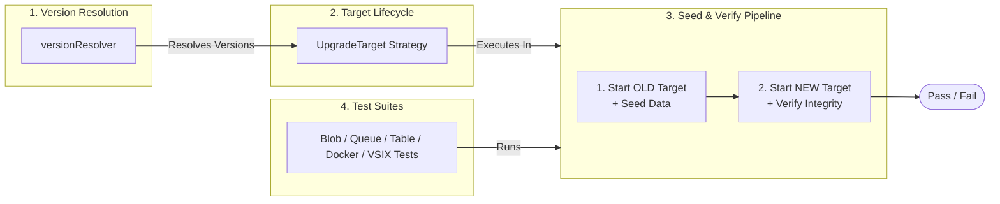
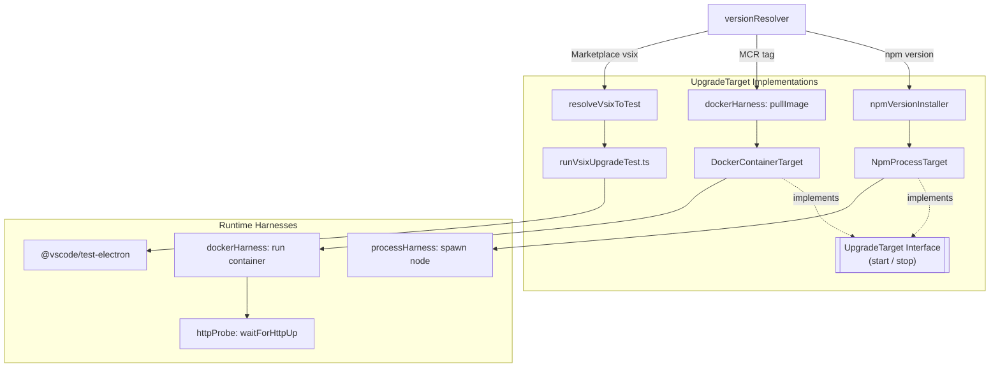
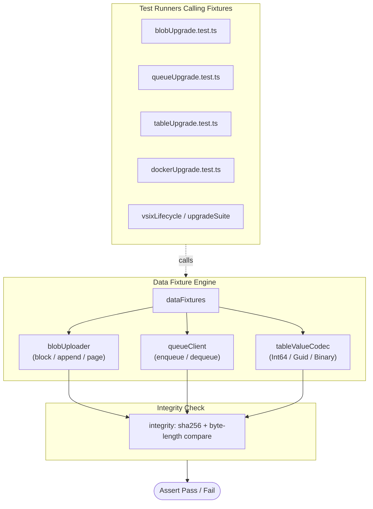

# Upgrade / persistence compatibility regression testing

- Author Name: GitHub Copilot (on behalf of the Azurite team)
- GitHub Issue: N/A (internal test infrastructure improvement)

## Summary

Azurite persists blob, queue, and table data to disk (LokiJS + extent files). Users routinely upgrade
Azurite (npm package, Docker image, VS Code extension, standalone binary) in place, expecting data written
by an older version to remain readable after the upgrade. Today there is no automated regression coverage
for this scenario. This proposes a new `tests/upgrade/` suite plus a dedicated CI workflow which will:

1. Installs the **latest published version no newer than the local build** (npm, MCR Docker image, or
   Marketplace VSIX), so the test never accidentally downgrades on a stale local checkout.
2. Seeds representative blob/queue/table data with it.
3. Replaces it with the **local build** (the code under test).
4. Re-reads and validates everything the old version wrote survived byte-for-byte / value-for-value.
5. Separately validates the VS Code extension packaging lifecycle: install `.vsix`, activate, start
   all three services, stop them - using an uncapped "latest" Marketplace lookup, since this check
   just needs _some_ installable VSIX, not an upgrade scenario.

The design is intentionally **version-agnostic**: nothing hardcodes a specific "old" version number.
The suite always resolves "the latest version currently published" at run time, so it keeps working
release after release with zero maintenance.

## Goals / requirements covered

| #   | Requirement                                                               | Where it's covered                                                                                     |
| --- | ------------------------------------------------------------------------- | ------------------------------------------------------------------------------------------------------ |
| 1   | Create data with an older released version, upgrade, verify data survives | `tests/upgrade/blobUpgrade.test.ts`, `queueUpgrade.test.ts`, `tableUpgrade.test.ts`                    |
| 2   | Install vsix, activate, start, stop                                       | `tests/upgrade/vsixLifecycle/suite/vsixLifecycle.test.js`, `tests/upgrade/vsixLifecycle/upgradeSuite/` |
| 3   | Validate txt/json/csv/xml/binary                                          | `tests/upgrade/utils/dataFixtures.ts`                                                                  |
| 4   | Byte-for-byte blob integrity across versions                              | `tests/upgrade/utils/integrity.ts` (`sha256` + length compare)                                         |
| 5   | Docker image upgrade (same mounted volume across image tags)              | `tests/upgrade/dockerUpgrade.test.ts`                                                                  |
| -   | Runs on demand locally + on every merge to `main`                         | `npm run test:upgrade*` scripts + `.github/workflows/UpgradeCompatibility.yml`                         |

## Architecture Overview

The architecture is split into three modular, high-level components to maintain clarity and separation of concerns.

---

### Part 1: High-Level Architecture (The Core Pipeline)

The overall workflow follows a four-step pipeline: resolving version tags, creating target environments, running the seed-and-verify upgrade sequence, and validating via test suites.



---

### Part 2: Target Lifecycle & Resolution Detail

This section details how dynamic version tags are resolved across various package sources (npm, Docker MCR, VS Code Marketplace) and mapped to specific runtime harnesses implementing the `UpgradeTarget` interface.



---

### Part 3: Data Fixtures & Verification Engine

The data verification suite uses identical shared fixture logic for Blob, Queue, and Table storage across both npm and Docker runtimes. Integrity checks validate SHA256 hashes and byte lengths post-upgrade.



The key structural point vs. an earlier draft: `blobUpgrade`, `queueUpgrade`, `tableUpgrade` and
`dockerUpgrade` no longer each hand-roll their own "start old / seed / stop / start new / verify"
plumbing. They all go through the same `UpgradeTarget` interface (`NpmProcessTarget` or
`DockerContainerTarget`) for lifecycle, and the same `blobUploader.ts` / `tableValueCodec.ts` for fixture
seeding and verification - so the Docker scenario is a drop-in alternate `UpgradeTarget`, not a parallel
implementation. Only the VSIX lifecycle test is structurally different, since its unit of work is a VS
Code Extension Host run rather than an HTTP-reachable server process.

### Directory layout

```
tests/upgrade/
  utils/
    versionResolver.ts     # resolves "latest published" npm/Marketplace/MCR versions dynamically
    npmVersionInstaller.ts # `npm install azurite@<version> --prefix <tmp>` into an isolated dir
    processHarness.ts       # generic start/stop of an Azurite CLI entry point (npm/local), ready-detection
    dockerHarness.ts        # thin `docker` CLI wrapper (pull/build/run/stop/rm)
    httpProbe.ts            # shared HTTP readiness polling, used by dockerHarness (and reusable elsewhere)
    upgradeTarget.ts         # `UpgradeTarget` interface + `NpmProcessTarget`/`DockerContainerTarget` adapters
    dataFixtures.ts         # txt/json/csv/xml/binary blob fixtures, queue + table entity fixtures
    blobUploader.ts         # uploads/verifies a `BlobFixture` via its declared blob type (block/append/page)
    tableValueCodec.ts      # builds/asserts typed table entity payloads (Int64/Guid/Binary wrapping+unwrapping)
    integrity.ts            # sha256 + byte-length compare, typed entity/message compare
  blobUpgrade.test.ts        # req 1, 3, 4
  queueUpgrade.test.ts       # req 1
  tableUpgrade.test.ts       # req 1
  vsixLifecycle/
    runVsixTests.ts          # outer driver: resolves+packages a vsix, downloads VS Code, runs suite
    runVsixUpgradeTest.ts    # outer driver for the vsix upgrade scenario: old (Marketplace) -> new (local)
    resolveVsixToTest.ts     # local build vs. latest-published Marketplace vs. explicit version/path
    driverExtension/         # minimal no-op extension whose Extension Host runs the assertions
      package.json
      extension.js
    suite/
      index.js                # mocha loader (bdd)
      vsixLifecycle.test.js    # req 2: activate, start, stop, HTTP probes
    upgradeSuite/             # req 1, 2, 3, 4: same seed/verify shape as blob/queue/table/docker upgrade tests
      upgradeTestUtils.js      # shared ports/container name/fixture suffix constants
      seedIndex.js             # mocha loader (bdd) for the seed phase
      seed.test.js             # phase 1: runs inside the published vsix, seeds blob/queue/table fixtures
      verifyIndex.js           # mocha loader (bdd) for the verify phase
      verify.test.js           # phase 2: runs inside the local vsix, asserts fixtures survived
  dockerUpgrade.test.ts       # req 1, 3, 4, 5: pull latest published MCR image -> build+run local image, same bind-mounted volume
```

`versionResolver.ts` additionally exposes `getLatestPublishedDockerTag()`, which paginates the public MCR
tags API (`https://mcr.microsoft.com/v2/azure-storage/azurite/tags/list`) and picks the newest plain
semver tag that is no newer than the local version (excluding `-amd64`/`-arm64`/`-preview` suffixes and
`latest`).
`utils/dockerHarness.ts` wraps the `docker` CLI (`pull`/`build`/`run -d`/`stop`/`rm`); readiness polling
lives once in `utils/httpProbe.ts` rather than being duplicated per-harness.

`utils/upgradeTarget.ts` defines a single `UpgradeTarget` interface (`start()`/`stop()`) implemented by
both `NpmProcessTarget` (npm-installed/local process, wraps `processHarness.ts`) and
`DockerContainerTarget` (wraps `dockerHarness.ts`). Every test file (`blobUpgrade`, `queueUpgrade`,
`tableUpgrade`, `dockerUpgrade`) orchestrates its old-target/new-target lifecycle through this same
interface, so the "seed with old, stop, start new, verify" shape is identical whether the target is an
npm process or a Docker container - only the fixture seeding/verification code differs, and even that is
shared (see decision 7 below).

### Key design decisions

1. **No hardcoded versions.** `versionResolver.ts` queries the npm registry
   (`GET https://registry.npmjs.org/azurite`) and the MCR tags API for the newest version that is no
   newer than the local `package.json` version (see decision 2 for why this matters). It exposes two
   Marketplace lookups: `getLatestPublishedMarketplaceVersion()` (uncapped - used only by the standalone
   lifecycle test, which just needs _some_ installable VSIX) and
   `getLatestPublishedMarketplaceVersionAtOrOlderThanLocal()` (capped like the npm/MCR lookups - used by
   `resolveMarketplaceVsixForUpgrade()` as the "old" side of the VSIX upgrade test, so a stale local
   checkout can't end up silently testing a downgrade instead of an upgrade). This means the suite
   automatically "just works" on every future release without code changes.
2. **Same on-disk `--location` across generations.** Both the "old" and "new" Azurite processes point at
   the same temp data directory (`--location`), started sequentially (old first, seed, stop; new second,
   read, stop). This is what actually exercises the LokiJS/extent persistence upgrade path, rather than
   copying files around.
3. **Generation-agnostic process harness.** `processHarness.ts` doesn't know or care whether it's
   launching an npm-installed old version's `dist/src/azurite.js` or the local workspace's
   `dist/src/azurite.js` - it just spawns `node <entry> --blobPort ... --location ...` and waits for the
   standard "successfully listening" log lines already used by `exe.test.ts` / `linuxbinary.test.ts`.
4. **Byte-for-byte validation**, not just "no error thrown". Fixtures include text, JSON, CSV, XML and a
   deterministic pseudo-random binary blob, each uploaded as **block**, **append**, and **page** blobs
   where applicable. SHA-256 + length are compared before/after upgrade.
5. **True VSIX lifecycle test** using `@vscode/test-electron`, matching how the real user installs the
   extension (`code --install-extension azurite-x.y.z.vsix`) rather than only loading source via
   `extensionDevelopmentPath`. A tiny no-op "driver" extension provides the `extensionTestsPath` Extension
   Host entry point. It calls `vscode.commands.executeCommand("azurite.start" | "azurite.close")` on the
   already-installed real Azurite extension and probes the default ports over HTTP to confirm the server
   actually came up/down - this avoids command-id collisions that would happen if the driver extension
   also declared the same commands.
6. **Independent of run environment.** Everything runs against temp directories
   (`fs.mkdtempSync(os.tmpdir())`), so tests are hermetic and safe to run repeatedly, locally or in CI,
   without manual cleanup.
7. **One fixture-handling implementation, reused everywhere - including Docker.** `utils/blobUploader.ts`
   (`uploadBlobFixture` / `assertBlobFixtureSurvived`) and `utils/tableValueCodec.ts`
   (`toCreateEntityPayload` / `assertEntityMatchesFixture` / `unwrapTypedValue`) encapsulate the
   blob-type routing (block/append/page) and OData typed-property wrapping (Int64/Guid/Binary)
   respectively. `blobUpgrade.test.ts`, `tableUpgrade.test.ts` and `dockerUpgrade.test.ts` all call the
   same functions, so the Docker scenario exercises the identical fixture set as the npm scenario
   (all three blob types, all typed table properties) instead of a reduced subset - and any future fix to
   fixture handling (e.g. another OData type) only needs to happen in one place.
8. **VSIX upgrade phases wait on the same `httpProbe.waitForHttpUp` used elsewhere**, rather than trusting
   `azurite.start` to have finished. The local build's `azurite.start` command awaits all three server
   managers before resolving, but `seed.test.js` runs against the already-published Marketplace extension,
   which may predate that fix; `verify.test.js`'s probes are a reachability check on top of the local
   build's own guarantee. Both phases await all three ports before touching any fixture, avoiding an
   intermittent `ECONNREFUSED` race. `seed.test.js` also enables the extension's `skipApiVersionCheck`
   setting, since the installed SDK clients may send a newer `x-ms-version` than an older published
   extension supports - mirroring `--skipApiVersionCheck` on the npm/Docker upgrade targets.

## npm scripts

```jsonc
"test:upgrade": "npm run build && mocha ... blobUpgrade.test.ts queueUpgrade.test.ts tableUpgrade.test.ts",
"test:upgrade:docker": "npm run build && mocha ... tests/upgrade/dockerUpgrade.test.ts",
"test:upgrade:vsix": "npm run build && node ... runVsixTests.ts && cross-env AZURITE_VSIX_UNDER_TEST=published-latest node ... runVsixTests.ts && node ... runVsixUpgradeTest.ts"
```

`test:upgrade:docker` is kept separate from `test:upgrade` (rather than a `tests/upgrade/*.test.ts` glob)
so that environments without Docker (e.g. plain local `npm test` runs) aren't forced to have it installed.
Unlike Docker, `test:upgrade:vsix` is a single script - like `test:upgrade` and `test:upgrade:docker` - that
chains all three VSIX phases (local lifecycle, published lifecycle, published->local upgrade) so there's
one command and one CI job per test area.

`AZURITE_VSIX_UNDER_TEST` controls which package is installed for the plain lifecycle phases of the VSIX
test (`runVsixTests.ts`; the upgrade phase always uses the published version for "old" and the local build
for "new", regardless of this variable):

- unset / `local` (default): package the current working tree with `vsce package`.
- `published-latest`: download the newest Marketplace-published VSIX.
- any other value: treated as an explicit version (downloaded from the Marketplace) or a path to an
  existing `.vsix` file.

## CI: `.github/workflows/UpgradeCompatibility.yml`

- Triggers: `push` to `main` (i.e. runs once a PR is merged, not on every PR push/sync) and
  `workflow_dispatch` (on-demand). Deliberately does **not** run on every `pull_request` event to avoid
  paying the npm-install / Docker-pull / VS Code download cost on every push to an open PR.
- Four jobs: `UpgradeCompatibility_Ubuntu` / `_Windows` (npm-based blob/queue/table upgrade tests),
  `VsixUpgrade_Ubuntu` (`xvfb-run`, since `@vscode/test-electron` needs a display; runs `test:upgrade:vsix`,
  which covers the plain lifecycle and the seed/verify upgrade scenario in one job), and
  `DockerImageUpgrade_Ubuntu` (Docker is preinstalled on GitHub-hosted Ubuntu runners).
- Jobs require network egress to `registry.npmjs.org`, `marketplace.visualstudio.com`, and
  `mcr.microsoft.com`.

## Follow-ups / explicitly out of scope for this first iteration

- SQL-backed metadata store upgrade (`AZURITE_TEST_DB`) - the initial suite targets the default LokiJS
  persistence. SQL persistence upgrade can be added as a parallel scenario file reusing the same fixtures.
- Re-adding a nightly `schedule` trigger is a one-line change if the team wants to also catch newly
  published npm/Marketplace/MCR releases outside of a merge to `main`.
- **Node engine version mismatches are not enforced, only logged.** The npm-based scenarios
  (`blobUpgrade.test.ts`/`queueUpgrade.test.ts`/`tableUpgrade.test.ts`) install the published "old"
  version but run it via `AzuriteProcessHandle` (`processHarness.ts`), which `fork()`s using the default
  `process.execPath` - the same Node runtime already running the local build. There's no `engine-strict`
  setting, so an `engines.node` mismatch between the installed package and the local build wouldn't fail
  the `npm install` either. `npmVersionInstaller.ts` logs both packages' declared `engines.node` plus the
  running Node version on every install, and best-effort `console.warn`s if the running major version
  looks too old for either side - but nothing fails the test itself, and there's no mechanism to actually
  run each target under its own matching Node version. The Docker scenario (`dockerUpgrade.test.ts`) isn't
  affected, since each image bundles its own Node runtime; the VSIX scenario shares this same class of gap
  for a different reason (old and new extension both run inside one downloaded VS Code's Extension Host).
